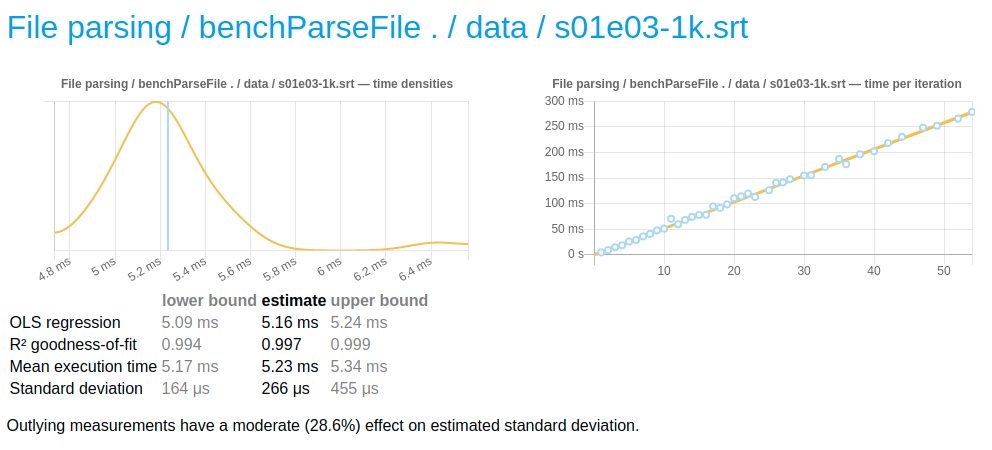

# hs-srt

- WIP
- no utf8 support

The example application just extracts all the words from the subtitles.

```
$ stack run -- ./data/s01e01-simple.srt
my
mother
died
today
or
maybe
yesterday
```

# Speed

It takes about `5ms` to parse `56KiB` (`1k` short subtitle lines).


